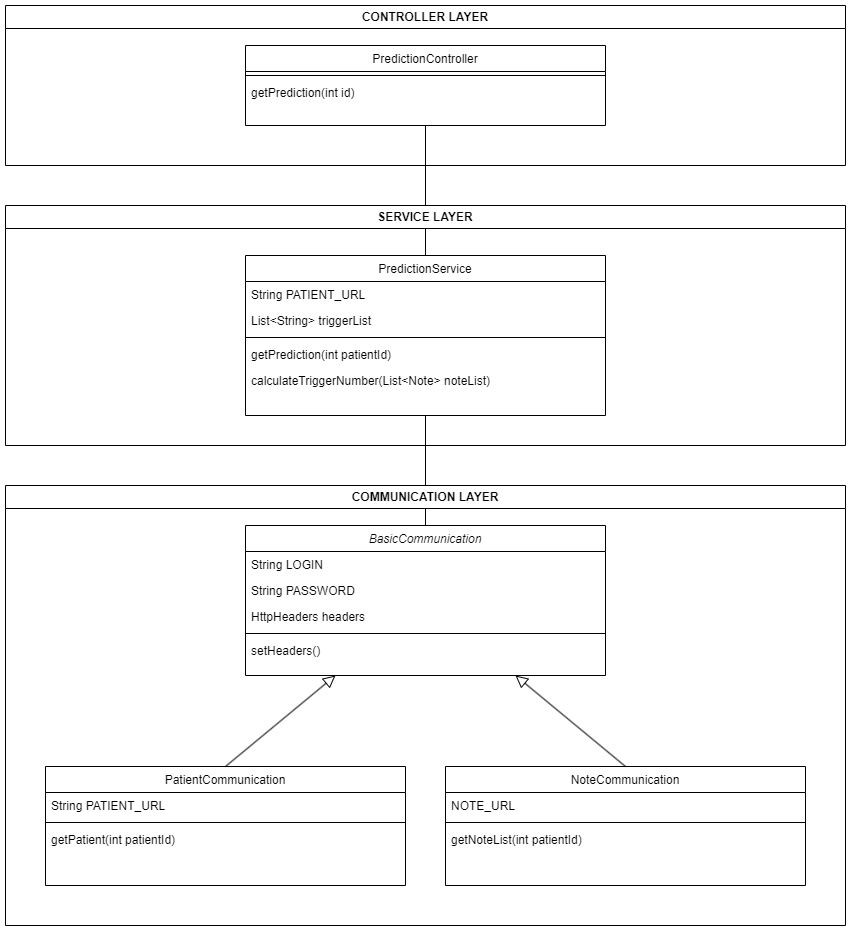

# OC_DA_JAVA_P9_Prediction

Note microservice for [medilabo](https://github.com/SimonArduin/OC_DA_JAVA_P9_Medilabo)

This application makes predictions about the risk of patients to develop diabetes. It is called through an API, and sends requests to the patient and note microservices to get the informations needed to run its algorithm.

It is built with Spring as a Maven project.

The application configuration is defined in [application.properties](prediction/src/main/resources/application.properties). By default, incoming requests are received on port 8002, and the requests to the gateway are sent to localhost:8010.
***
# CLASS DIAGRAM

